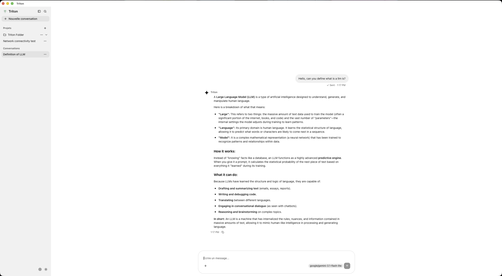

# Triton

A small AI agent harness built from scratch in Python, as a learning project to understand how tools like Claude Code work under the hood: the loop that turns a plain LLM into an agent capable of using tools, keeping memory, and acting safely.



## What's a harness?

An LLM on its own only does one thing: take text in, give text out. It can't read a file, run a command, remember yesterday, or decide on its own when to stop.

The **harness** is all the code around the model that turns it into an agent capable of acting: the loop that calls the API, gives the model a list of tools it can ask to use, actually executes those tools, feeds the result back to the model, repeats until a final answer, and handles memory, permissions, and errors around all of that.

The model is the "brain" (it decides what to do), the harness is the "body" (it's what actually lets it happen, within a safe boundary). Claude Code, Cursor, Aider, or LangChain's `AgentExecutor` are all harnesses: same underlying model, but a different harness makes for a completely different tool in practice.

### The base loop

```
1. The user writes a message
2. The harness sends the full history + available tools to the model
3. The model replies either:
   a. with final text -> display it, go back to step 1
   b. with a tool request ("call read_file with path=main.py")
4. On a tool request: the harness actually runs the tool, appends the result
   to the history, and goes back to step 2 (without asking the user again)
5. Repeat until a final answer, with a max iteration limit
```

This loop (called "ReAct" in the literature: Reason + Act) is the core of any harness, from the simplest to the most complex. Everything else (memory, permissions, observability) is built around it.

## Features

- Multi-turn chat with streaming responses
- Tool calling in a ReAct-style loop: read files, list directories, write files, run shell commands
- Permission prompt before any action that modifies something (writing a file, running a command), with an "always allow" option scoped to the current conversation
- Automatic context compression once the conversation history grows too large
- Persistent sessions: conversations are saved to disk and resumed automatically on the next run
- Structured JSONL logs, plus a small script to summarize them
- MCP client: connect to external [Model Context Protocol](https://modelcontextprotocol.io) servers as an additional source of tools, configurable at runtime (no restart needed) from the desktop app's settings

## Stack

- Python 3.13, managed with [uv](https://docs.astral.sh/uv/)
- OpenAI-compatible SDK, calling models through [OpenRouter](https://openrouter.ai)
- [rich](https://github.com/Textualize/rich) for the terminal UI, [prompt_toolkit](https://github.com/prompt-toolkit/python-prompt-toolkit) for input

## Running it

```
uv sync
cp .env.template .env   # fill in your OpenRouter API key
uv run main.py
```

To inspect the logs afterward:

```
uv run triton-logs-summary
```

## Desktop app

`app-desktop/` is a [Tauri](https://tauri.app) + React app that talks to `server.py`, a small FastAPI server exposing the same agentic loop over HTTP (streaming via Server-Sent Events, with tool confirmations paused mid-stream until the client approves or denies them).

Its interface is built with [Astryx](https://astryx.atmeta.com/docs/getting-started), Meta's open-source React design system: components (`AppShell`, `SideNav`, the `Chat*` family) plus a Tailwind v4 token bridge, no separate build step required.

Run the API first, then the app:

```
uv run server.py
```

```
cd app-desktop
pnpm install
pnpm tauri dev
```

### Packaging a standalone build

`pnpm tauri build` alone only bundles the frontend - the API still has to be started separately (`uv run server.py`), which is fine in dev but not for a real double-click app on a machine with no Python/uv installed. For that, `server.py` gets frozen into a standalone executable with [PyInstaller](https://pyinstaller.org) and bundled as a [Tauri sidecar](https://v2.tauri.app/develop/sidecar/): the desktop app spawns it automatically on launch and kills it on quit (release builds only - `pnpm tauri dev` still expects the separate `uv run server.py` process, so the two don't fight over port 8000).

```
./packaging/build_server.sh   # freezes server.py, must run on the target OS (no cross-compiling)
cd app-desktop
pnpm tauri build
```

Two things to know about this:

- **Where data lives once packaged**: a frozen build can't sensibly use "the repo root" for `sessions/`, `logs/`, `.env`, etc. (see `src/triton/paths.py`) - it uses the OS's standard per-user app data directory instead (`~/Library/Application Support/Triton` on macOS, `%APPDATA%/Triton` on Windows). On first launch there's no `.env` there yet; copy one over (with `OPEN_ROUTER_API_KEY` set) before expecting real model calls to work - there's no in-app onboarding for this yet.
- **Windows**: only built and tested on macOS (`aarch64-apple-darwin`) so far. `packaging/build_server.sh` should work the same way in principle on Windows (PyInstaller and Tauri both support it), but hasn't been verified - and a few of the harness's tools (`run_shell`, and the model's own habit of writing bash-style commands) assume a POSIX shell, which Windows' `cmd.exe` isn't.

Both halves of the project are linted strictly, wired together with [pre-commit](https://pre-commit.com) so nothing gets committed with warnings:

- Python: [ruff](https://docs.astral.sh/ruff/) (lint + format), [basedpyright](https://docs.basedpyright.com/) (`standard` type-checking mode), and a `tests/` pytest suite covering the pure logic (no network call) - history compression, the project sandbox, the multi-agent planner's JSON parsing, `format_args` - including a couple of straight regression tests for bugs found the hard way (`finish_reason` truncation, a `.format()` crash on literal JSON braces)
- `app-desktop/`: [ESLint](https://eslint.org/) (`typescript-eslint`'s `strictTypeChecked` + `stylisticTypeChecked`, `eslint-plugin-react-hooks`) with `--max-warnings=0`, plus `tsc --noEmit`

Run the Python tests directly with `uv run pytest`.

First-time setup after cloning:

```
uv sync
uv run pre-commit install
```

From then on, `git commit` runs every check automatically and blocks the commit on any failure. Run everything by hand at any time with:

```
uv run pre-commit run --all-files
```

## Harness architecture

```
harness/
├── main.py                    ENTRY POINT #1 : interactive CLI (rich + prompt_toolkit)
├── server.py                  ENTRY POINT #2 : the same loop over HTTP/SSE, for the desktop app
│
├── src/triton/                everything main.py and server.py import from (installed editable, see pyproject.toml)
│   ├── paths.py                ROOT_DIR: repo root (or the OS app-data dir once packaged, see
│   │                            packaging/), used by every storage/ module below
│   ├── background_tasks.py     long-running processes started by the model (start_background_task)
│   ├── mcp_client.py           connects to configured MCP servers, merges their tools into tools.TOOLS_REGISTRY
│   ├── logs_summary.py         CLI summary of the logs (uv run triton-logs-summary)
│   │
│   ├── llm/                    calling the model, independent of any particular loop or role
│   │   ├── api.py               call_chat() / stream_chat(), the ChatResult type
│   │   ├── chat_loop.py         the agentic loop's shared core: build_system_message, timed_call_chat /
│   │   │                        timed_stream_chat, compress_history_if_needed - everything both entry
│   │   │                        points and orchestrator.py need, with no Rich/FastAPI dependency
│   │   ├── model_roles.py       which OpenRouter model handles which multi-agent role
│   │   └── pricing.py           OpenRouter pricing lookup, for cost-per-call estimates
│   │
│   ├── agents/                 multi-step/multi-agent work built on top of llm/
│   │   ├── orchestrator.py      multi-agent mode (/multi-agents <task>): planner + parallel subtasks
│   │   └── subagents.py         single-subagent dispatch (check_subagent)
│   │
│   ├── storage/                persisted state, all plain JSON files under the repo root
│   │   ├── sessions.py          conversation persistence (JSON) and their titles
│   │   ├── projects.py          project folders a conversation can be scoped to
│   │   ├── settings.py          persisted preferences: selected model, monthly budget, API key
│   │   └── logs.py              structured logs, one JSON event per line (logs/events.jsonl)
│   │
│   └── tools/                  tools exposed to the model, one category per file
│       ├── _shared.py           the Tool type, invoke_tool, enforce_project_sandbox
│       ├── filesystem.py        read_file, write_file, edit_file, delete_file, move_file, list_files
│       ├── search.py            grep, glob
│       ├── git.py               git_status, git_diff, git_commit
│       ├── process.py           run_shell, run_tests
│       ├── web.py               fetch_url, web_search
│       ├── memory.py            todo_write, remember/load_memory (memory.md)
│       └── background.py        dispatch_subagent/check_subagent, start/stop/list background tasks -
│                                thin wrappers, the real logic lives in agents.subagents /
│                                background_tasks.py
│
└── app-desktop/               Tauri + React GUI, talks to server.py
    └── src/
        ├── App.tsx            chat view: sidebar, streaming, tool confirmations
        ├── SettingsModal.tsx  settings (a modal, not a page): API key, model, multi-agent roles,
        │                      MCP servers, logs & costs - one category per file alongside it
        │                      (ApiKeySettings.tsx, ModelSettings.tsx, RoleModelsSettings.tsx,
        │                      McpSettings.tsx, LogsSettings.tsx)
        └── NewProjectModal.tsx project creation, same modal pattern
```

**Two entry points, one loop.** `main.py` and `server.py` stay at the repo root (they're what you actually run), and both drive the exact same agentic loop, built from the same `src/triton/` pieces above (`llm/api.py`, `llm/chat_loop.py`, `tools/`, `storage/sessions.py`, `storage/logs.py`), just through different interfaces:

- `main.py` talks to a human directly in a terminal: synchronous, renders with `rich`, confirms risky tools with a blocking `Confirm.ask()`.
- `server.py` drives the same loop for the desktop app over HTTP: streams events as Server-Sent Events, and pauses on a tool confirmation with a `threading.Event` instead of blocking on terminal input, since there is no terminal to block on.

To avoid duplicating the loop itself, both import the shared core straight from `triton.llm.chat_loop` (`compress_history_if_needed`, `timed_stream_chat`, `to_tool_call_params`, `build_system_message`) instead of either one depending on the other. Only the tool-confirmation flow is genuinely rewritten in `server.py`, because a terminal prompt and an HTTP request/response are fundamentally different I/O models, everything else is shared code.

`tools/` is a package rather than one file specifically so each category (filesystem, search, git, ...) stays small and easy to find a tool in - `from triton.tools import TOOLS_REGISTRY` (and everything else re-exported from `tools/__init__.py`) works exactly the same as when it was a single ~1000-line module, nothing outside the package needs to know it's split up.

### MCP servers

Instead of hand-writing every tool in `tools/`, the harness can connect to external [MCP](https://modelcontextprotocol.io) servers and treat their tools the same way as local ones. Same config shape as Claude Desktop: a name, a command, arguments, and environment variables.

The MCP SDK is async; the rest of the harness (`Tool.fn`) is synchronous. `mcp_client.py` runs a dedicated asyncio event loop in a background thread that keeps every connected server's session open, and each tool's synchronous `fn` submits its call to that loop and blocks for the result (`asyncio.run_coroutine_threadsafe`). Connected tools are merged into `tools.TOOLS_REGISTRY` under a `mcp__<server>__<tool>` key, so `main.py` and `server.py` need zero changes to pick them up. A tool is required to confirm before running (like `write_file` or `run_shell`) unless the server explicitly marks it `readOnlyHint: true`.

Manage servers from the desktop app (Settings → Serveurs MCP) or directly against the API:

```
GET    /mcp/servers          list configured servers, their connection status and tools
POST   /mcp/servers          add a server ({name, command, args, env}) and connect immediately
PUT    /mcp/servers/{name}   enable/disable ({enabled: bool}), connecting or disconnecting it
DELETE /mcp/servers/{name}   remove a server
```

`mcp_servers.json` (gitignored, same reasoning as `.env`: it can hold real API keys in `env`) stores the configuration; enabled servers reconnect automatically on the next `uv run main.py` or `uv run server.py`.
